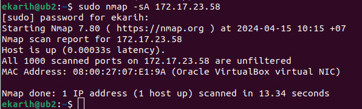
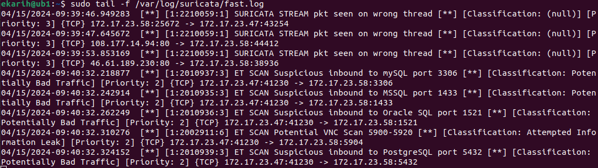
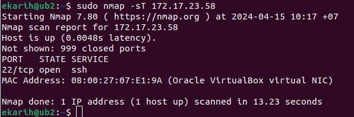
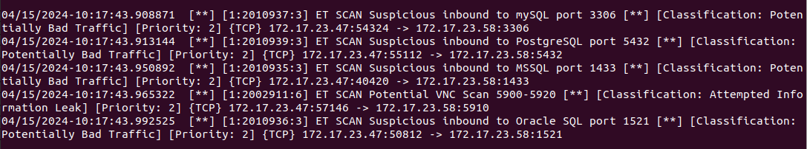
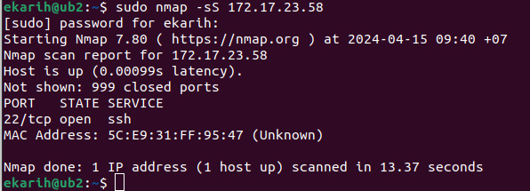
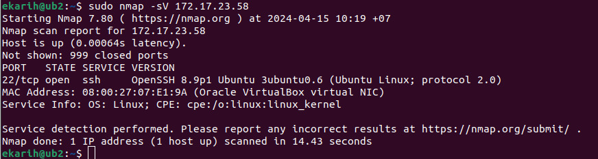
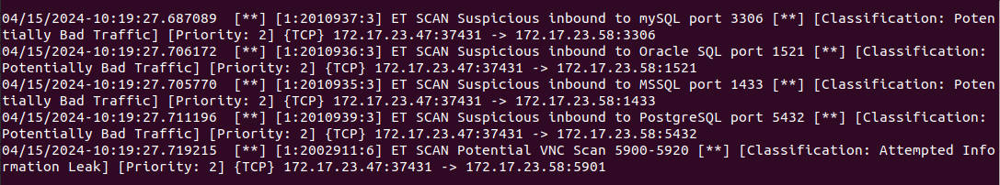
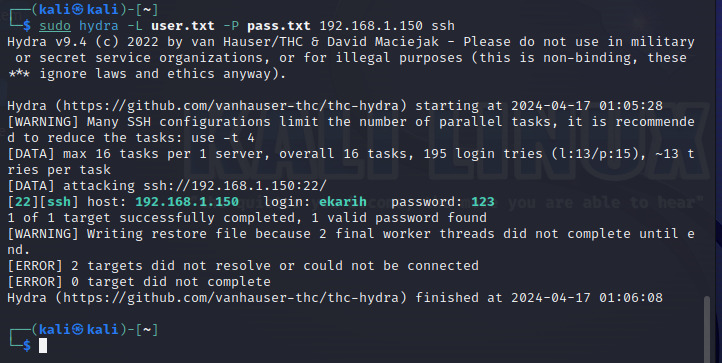
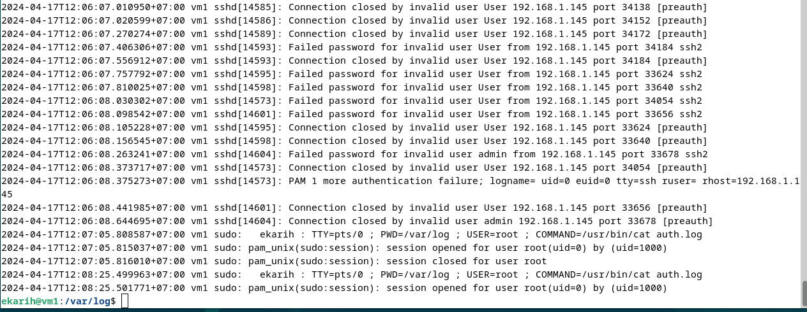
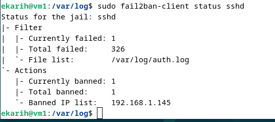

## Домашнее задание к занятию "Защита сети" - Карих Елена
---
### Задание 1

Проведите разведку системы и определите, какие сетевые службы запущены на защищаемой системе:

```
sudo nmap -sA < ip-адрес >
sudo nmap -sT < ip-адрес >
sudo nmap -sS < ip-адрес >
sudo nmap -sV < ip-адрес >
```

По желанию можете поэкспериментировать с опциями: https://nmap.org/man/ru/man-briefoptions.html.
В качестве ответа пришлите события, которые попали в логи Suricata и Fail2Ban, прокомментируйте результат.

### Решение 1

ПО suricata, fail2ban установлена на Ubuntu с IP 172.17.23.58, nmap установлена так же на Ubuntu с IP 172.17.23.47

```
sudo nmap -sA 172.17.23.58
```


Информация в лог-файле suricata:



``` 
sudo nmap -sT 172.17.23.58
```


Информация в лог-файле suricata:



``` 
sudo nmap -sS 172.17.23.58
```


Информация в лог-файле suricata:


``` 
sudo nmap -sV 172.17.23.58
```


Информация в лог-файле suricata:



Посмотрела и лог файл fail2ban, и эти запрсы в нем не отражались совсем...что логично, ведь смотрит auth.log а это фиксация попыток  авторизации. Скорее всего его функционал более широк, но необходимо до-настраивать))

### Задание 2

Проведите атаку на подбор пароля для службы SSH:

```
hydra -L users.txt -P pass.txt < ip-адрес > ssh
```
1. Настройка hydra:
- создайте два файла: users.txt и pass.txt;
- в каждой строчке первого файла должны быть имена пользователей, второго — пароли. В нашем случае это могут быть случайные строки, но ради эксперимента можете добавить имя и пароль существующего пользователя.

Дополнительная информация по hydra: https://kali.tools/?p=1847.

2. Включение защиты SSH для Fail2Ban:
-  открыть файл /etc/fail2ban/jail.conf,
-  найти секцию ssh,
-  установить enabled в true.

Дополнительная информация по Fail2Ban:https://putty.org.ru/articles/fail2ban-ssh.html.
В качестве ответа пришлите события, которые попали в логи Suricata и Fail2Ban, прокомментируйте результат.

### Решение 2

ДЗ делала уже дома)) использовала KaliLinux (IP 192.168.1.145) и Debian (IP 192.168.1.150)



Лог без активного fail2ban:



И забаненый IP при запросе с активным fail2ban:



Лог suricata показывает множественное обращение по 22 порту
---
